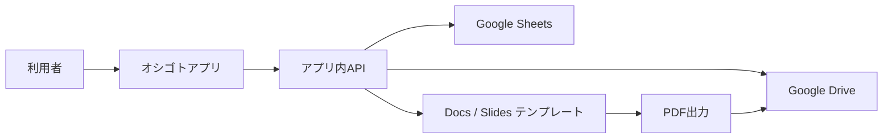

# 技術方式の選択肢

## 候補A: AppSheetを作り直す

### 良い点

- 早く作れる。
- Google Sheetsとの相性が良い。
- スマホ入力に強い。
- 既存の考え方を引き継ぎやすい。

### 気になる点

- GitHubで画面や処理を履歴管理しにくい。
- UIの自由度が限られる。
- 複雑な帳票やエラー制御が難しくなる可能性がある。
- 将来、細かく作り込みたいときに限界が来やすい。

## 候補B: Google Apps Script中心

### 良い点

- Google Drive、Sheets、Docs、Slidesとの相性が非常に良い。
- PDF生成やテンプレ置換を作りやすい。
- 小さく始められる。

### 気になる点

- 本格的なアプリ画面は作りにくい。
- コードが増えると保守が難しくなりやすい。
- GitHub管理には工夫が必要。

## 候補C: PWA寄りのWebアプリ

### 良い点

- スマホとPCの両方で使える。
- GitHubで履歴管理しやすい。
- 画面を業務に合わせて作れる。
- 将来、データベース化や権限管理に拡張しやすい。
- ホーム画面に追加すればスマホアプリのように使える。

### 気になる点

- AppSheetより初期設計が必要。
- Google連携、認証、PDF生成の設計を丁寧に決める必要がある。

### 現時点の評価

第一候補。

「保守しやすく、将来の拡張に強い」という目標と相性が良い。

## 候補D: ネイティブスマホアプリ

### 良い点

- スマホでの体験は作り込みやすい。
- カメラや通知などを使いやすい。

### 気になる点

- 開発と配布が重くなる。
- PCでの確認や集計には別画面が必要になる。
- 最初の選択肢としては大きすぎる。

## 推奨方針

最初は「PWA寄りのWebアプリ」を前提に設計する。

ただし、既存のGoogle資産をいきなり捨てない。
まずはGoogle Sheets / Drive / Docs / Slidesを活かし、将来データベースへ移せるように境界を分ける。

## 初期アーキテクチャ案

## 設計上の分け方

### 画面

利用者が見る入力・一覧・確認画面。

### データ

報告書、日報、請求、マスタなどの保存先。

### 帳票

Google Docs / SlidesやPDF生成の仕組み。

### 連携

Google DriveやGoogle Sheetsにアクセスする部分。

### 設定

作業者名、請求先、単価、保存先フォルダなど。

この5つを分けておくと、後から変更しやすい。
